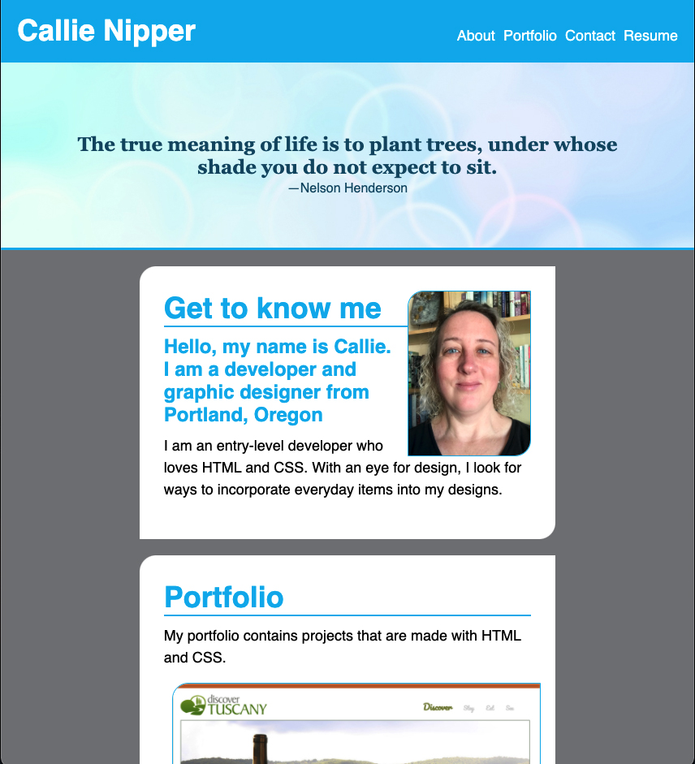

# Portfolio
A portfolio of my work

A responsive portfolio containing my resume and links to a few projects that I created using HTML and CSS.

The page should resize to fit the device that it is being viewed on. It contains both internal anchor links as well as links to websites that I created previously.

I think that I hit all of the requirements, but I ran out of time before I could figure out how to get my 2 smaller images to float next to each other in the portfolio section.

Thanks for your feedback!

GitHub link

Deployable link

Header Image credit
<a href="https://www.publicdomainpictures.net/en/view-image.php?image=317882&picture=abstract-background">PublicDomainPictures.net</a>

References
<a href="https://codetheweb.blog/">Code the Web</a>
